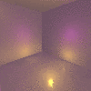
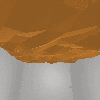
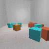
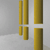
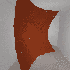
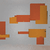

<html>

<head>
  <meta charset="utf-8" /> 
  <title>About</title>
  <link rel="stylesheet" href="styles.css">
</head>

<body>
  

    <header  style="margin-left: 0%; margin-right: 0%;">
      <nav>
        <ul>
			<li><a>IGATY</a></li>
			<li><a class="active" href="index.html">ABOUT</a></li>
			<li><a href="explore/index.html">EXPLORE!</a></li>
			<li><a href="research.html">RESEARCH</a></li>
			<li><a href="people.html">PEOPLE</a></li>
			<li><a href="search.html">SEARCH</a></li>
        </ul>
      </nav>
    </header>
	
  

  
  <section>
	
Welcome to IGATY! 

	
IGATY is an online interactive ideation system designed to guide interior designers’ creative ideation process. IGATY was developed based on the archetypes theory. What is archetype? An archetype is an original basis, main ingredient, and a fundamental principle that prevails in all later forms. Schön (1988) states that archetypes serve as “generative images” (p. 187) and “sources of leading ideas” (p. 188). The system visualizes rich transformative potentials imbedded in each archetype and allows the user to interact with the system to initiate idea exploration. The system uses intypes (interior archetypes) developed by Cornell University’s Intypes Research and Teaching Project group. If you want to find more information about intypes, please visit here: <a href = "https://intypes.cornell.edu/index.cfm">https://intypes.cornell.edu/index.cfm</a>. Currently, there are 24 interior archetypes available in this system. Users can select the archetypes, set the parameters of each archetype, mix and match more than two archetypes, make each archetype evolve through generations, or stop the evolution process of one or more individual archetypes. 

	
Click below to explore!

  </section>
  
  <footer style="margin-left: 22%; width: 49%;">
  
    <h1 style="background-color: #777; padding: 10px;"><a href="explore/index.html" style = "text-decoration: none; color: #FFF;">EXPLORE!</a></h1>
	
	
	
	
	
	
	
  </footer>

</body>

</html>
